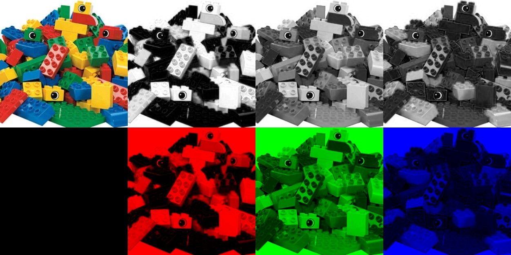

# Лабораторная 1.

Студентка: Денисова Е.А.  

url: [https://github.com/edenisova/denisovaea](https://github.com/edenisova/denisovaea)

## Задание

Нарисовать на одном изображении исходную картинку и ее разложения на три канала


## Результаты




## Текст программы

```c++
#include <opencv2\highgui.hpp>
#include <iostream>

using namespace cv;
using namespace std;

int main() {
	Mat img = imread("../image1.jpg");
	Mat empty_image = Mat::zeros(img.rows, img.cols, CV_8UC1);
	Mat main_img = Mat::zeros(img.rows * 2, img.cols * 4, CV_8UC3);
	vector<Mat> spl;
	split(img, spl);
	img.copyTo(main_img(Rect(0, 0, img.cols, img.rows)));

	Mat result_blue(img.rows, img.cols, CV_8UC3);
	Mat result_green(img.rows, img.cols, CV_8UC3);
	Mat result_red(img.rows, img.cols, CV_8UC3);
	Mat red_channel_res(img.rows, img.cols, CV_8UC3);
	Mat green_channel_res(img.rows, img.cols, CV_8UC3);
	Mat blue_channel_res(img.rows, img.cols, CV_8UC3);

	Mat red_channel[] = { spl[2], spl[2], spl[2] };
	int from_to1[] = { 0,0, 1,1, 2,2 };
	mixChannels(red_channel, 3, &red_channel_res, 1, from_to1, 3);
	red_channel_res.copyTo(main_img(Rect(img.cols, 0, img.cols, img.rows)));

	Mat green_channel[] = { spl[1], spl[1], spl[1] };
	mixChannels(green_channel, 3, &green_channel_res, 1, from_to1, 3);
	green_channel_res.copyTo(main_img(Rect(img.cols * 2, 0, img.cols, img.rows)));

	Mat blue_channel[] = { spl[0], spl[0], spl[0] };
	mixChannels(blue_channel, 3, &blue_channel_res, 1, from_to1, 3);
	blue_channel_res.copyTo(main_img(Rect(img.cols * 3, 0, img.cols, img.rows)));

	Mat in3[] = { empty_image, empty_image, spl[2] };
	mixChannels(in3, 3, &result_red, 1, from_to1, 3);
	result_red.copyTo(main_img(Rect(img.cols, img.rows, img.cols, img.rows)));

	Mat in2[] = { empty_image, spl[1], empty_image };
	mixChannels(in2, 3, &result_green, 1, from_to1, 3);
	result_green.copyTo(main_img(Rect(img.cols * 2, img.rows, img.cols, img.rows)));

	Mat in1[] = { spl[0], empty_image, empty_image };
	mixChannels(in1, 3, &result_blue, 1, from_to1, 3);
	result_blue.copyTo(main_img(Rect(img.cols * 3, img.rows, img.cols, img.rows)));

	imshow("res", main_img);
	imwrite("img_res.jpg", main_img);

	waitKey(0);
	return 0;

}
```

