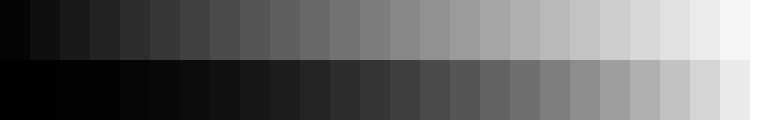

# Лабораторная 2, пункт 2.

Студентка: Денисова Е.А.  

url: [https://github.com/edenisova/denisovaea](https://github.com/edenisova/denisovaea)

## Задание

Часть 1.

Нарисовать на одном изображении:  

1. Прямоугольник размером 768х60 пикселя со ступенчатым изменение пикселей от черного к белому (от 5 с шагом 10), одна градация серого занимает 30 пикселя по горизонтали.  
2. Изображение этого градиента после гамма-коррекции с коэффициентом из интервала 2.2-2.4.


## Результаты

Коэффициент гамма-коррекции равен 2.2:




## Текст программы

```c++
#include <opencv2\highgui.hpp>
#include <opencv2\core\mat.hpp>
#include <opencv2\core.hpp>
#include <opencv2\imgproc\imgproc.hpp>
#include <iostream>

using namespace cv;
using namespace std;

int main() {
	int height = 60;
	int width = 768;
	Vec3b val;
	double fractpart, intpart, gamma;
	Mat image(height, width, CV_8UC3);
	Mat res;
	Mat img_res(height * 2, width, CV_8UC3);
	Mat lookUpTable(1, 256, CV_8U);
	uchar* p = lookUpTable.ptr();
	Rect rect1 = Rect(0, 0, 768, 60);
	Rect rect2 = Rect(0, 60, 768, 60);

	cout << "Input gamma" << endl;
	cin >> gamma;

	for (int x = 0; x < width; x++) {
		fractpart = modf(x / 30, &intpart);
		val[0] = 5 + (intpart * 10); val[1] = 5 + (intpart * 10); val[2] = 5 + (intpart * 10);
		for (int y = 0; y < height; y++)
			image.at<Vec3b>(y, x) = val;
	}
	image.copyTo(img_res(rect1));

	for (int i = 0; i < 256; ++i) {
		p[i] = saturate_cast<uchar>(pow(i / 255.0, gamma) * 255.0);
	}

	res = image.clone();
	LUT(image, lookUpTable, res);

	res.copyTo(img_res(rect2));

	imshow("res", img_res);
	imwrite("img_res.jpg", img_res);

	waitKey(0);
	return 0;
}
```

