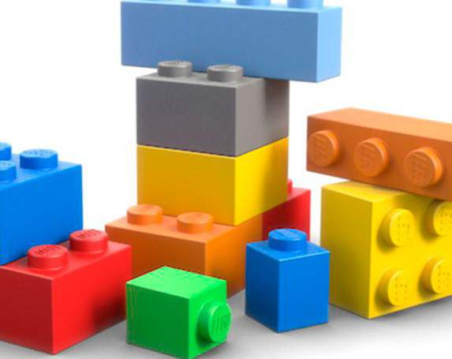
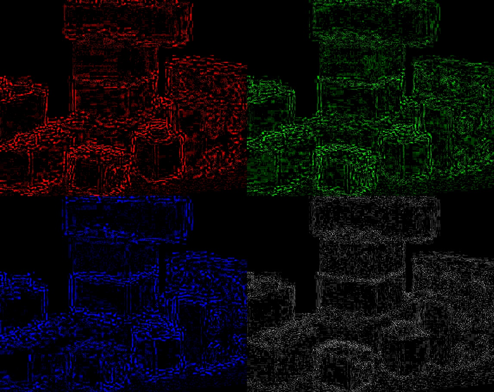

# Лабораторная 3.

Студентка: Денисова Е.А.  

url: [https://github.com/edenisova/denisovaea](https://github.com/edenisova/denisovaea)

## Задание

Для исходного изображения (сохраненного без потерь) создать jpeg версии с двумя уровнями качества (например, 95 и 65). Вычислить и визуализировать на одной “мозаике” поканальные и яркостные различия.

## Результаты

Исходная картинка:


Картинка с уровнем качества 65:



Картинка с уровнем качества 95:


Результирующая мозаика:




## Текст программы

```c++
#include <opencv2\highgui.hpp>
#include <iostream>
#include <opencv2\core.hpp>
#include <opencv2\imgproc\imgproc.hpp>

using namespace cv;
using namespace std;

Mat difference(Mat img) {
	Mat main_img = Mat::zeros(img.rows * 2, img.cols * 2, CV_8UC3);
	Mat empty_image = Mat::zeros(img.rows, img.cols, CV_8UC1);
	int from_to1[] = { 0,0, 1,1, 2,2 };
	Mat gray;
	vector<Mat> spl;
	split(img, spl);

	Mat result_blue(img.rows, img.cols, CV_8UC3);
	Mat result_green(img.rows, img.cols, CV_8UC3);
	Mat result_red(img.rows, img.cols, CV_8UC3);

	Mat in3[] = { empty_image, empty_image, spl[2] };
	mixChannels(in3, 3, &result_red, 1, from_to1, 3);
	result_red.copyTo(main_img(Rect(0, 0, img.cols, img.rows)));

	Mat in2[] = { empty_image, spl[1], empty_image };
	mixChannels(in2, 3, &result_green, 1, from_to1, 3);
	result_green.copyTo(main_img(Rect(img.cols, 0, img.cols, img.rows)));

	Mat in1[] = { spl[0], empty_image, empty_image };
	mixChannels(in1, 3, &result_blue, 1, from_to1, 3);
	result_blue.copyTo(main_img(Rect(0, img.rows, img.cols, img.rows)));	

	cvtColor(img, gray, COLOR_BGR2GRAY);
	cvtColor(gray, gray, COLOR_GRAY2BGR);
	gray.copyTo(main_img(Rect(img.cols, img.rows, img.cols, img.rows)));

	return main_img;
}

int main() {
	Mat img = imread("lego.jpg");

	vector<int> params65;
	params65.push_back(IMWRITE_JPEG_QUALITY);
	params65.push_back(65);
	vector<int> params95;
	params95.push_back(IMWRITE_JPEG_QUALITY);
	params95.push_back(95);

	imwrite("lego65.jpg", img, params65);
	imwrite("lego95.jpg", img, params95);

	Mat img65 = imread("lego65.jpg");
	Mat img95 = imread("lego95.jpg");

	Mat newimg65 = difference(img65);
	Mat newimg95 = difference(img95);

	Mat img_res = (newimg95 - newimg65) * 30;

	imshow("", img_res);
	imwrite("img_res.jpg", img_res);

	waitKey(0);
	return 0;

}
```


